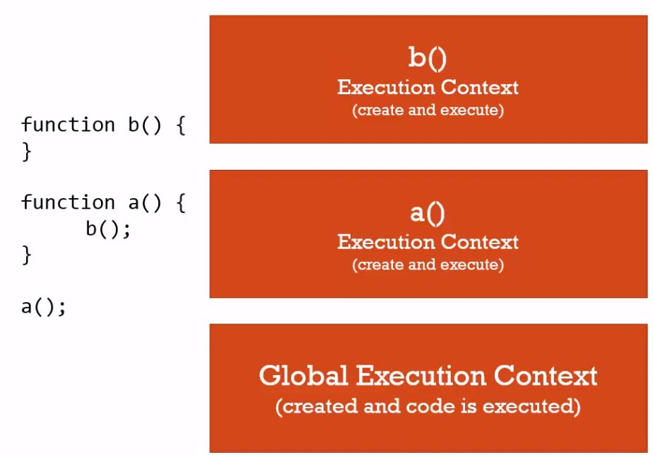
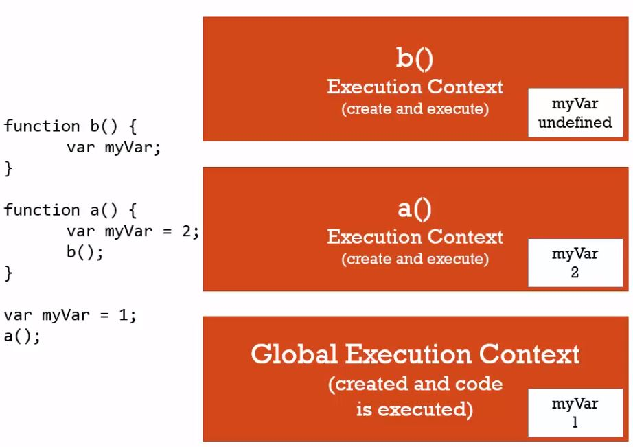
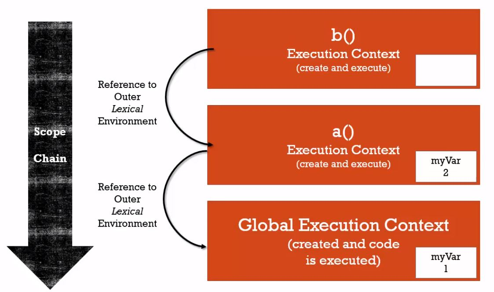
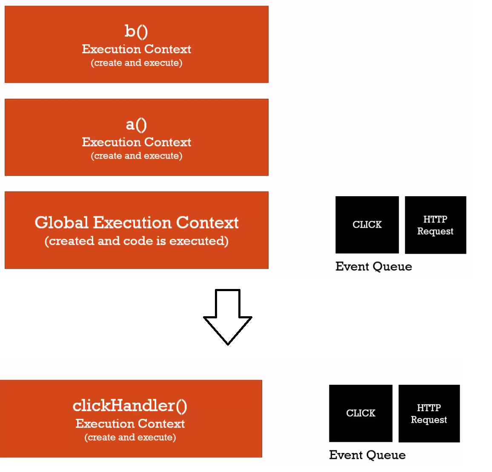

**Syntax parser** - a program that reads your code
and determines what it does and if its grammar is valid.

**Lexical environment** - where something sits physically
in the code you write. A variable inside of a function
sits physically inside of the function. Lexically 
inside that function. Where it's written and what
surrounds it.

**Execution context** - a wrapper to help manage the
code that is running. There are lots of lexical
environments. Which one is currently running is managed
via execution contexts. It can contain things beyond
what you've written in your code.

**Name/value pair** - a name which maps to a unique
value. The name may be defined more than once, but
can only have one value in any given context.
That value may be assigned to more names.

**Object** - a collection of name value pairs.

Every time code is executed, it is inside of an
execution context. It can be inside multiple
contexts. The base execution context is
the global execution context. It is accessible
to everything everywhere in your code. It creates
a global object and the special keyword `this`.
The window object is the global object inside of
browsers. If you're running NodeJS, then the global
object will be different, but can still be referenced
using `this`. There is always a global object. 
Each tab has its own execution context, so the global
object isn't shared between them. At the global
level the global object is the same as this.
Global means something that is not inside a function.

There is a thing such as the outer environment,
however, for the global context that is null, 
because you're as outside as you can be.

**Single threaded** - JS is single threaded from the point of view of programmers.
It might not be executing with a single thread under the hood of the browser, though.

**Synchronous** - one at a time and in order.

Javascript is single-threaded and synchronous in its behavior.

Calling a function creates a new entry in the execution stack, it goes to the top.
The new stack entry will have its own variables and whatnot. It goes through the same
create and execute phases, but inside of that function. If we have another function,
then it'll stop, go into that and start another execution context. Every function
creates a new execution phase. Once the function execution ends, then the context
is popped off the stack.

**Variable environment** - where the variables live and how they related to each other
in memory. Each execution context gets its own variable environment.

Every execution context has a reference to its outer environment. The outer environment
depends on where the function sits lexically. When a function cannot find a variable
inside of its variable environment, then it turns to the outer environment. The
execution context depends on where the function is called, but the outer environment
looks at where the code was written. The outer environment search is a chained operation.
It keeps going through the outer environments, trying to find a declared variable.
So if you have functions defined inside of functions, then it chains all the way up
trying to find the variable definition.

**Scope** - where a variable is available in your code and if it's truly the same variable
or a new copy.

When the functions are declared on the same global level, then the scope chain looks 
like this.

However, when the functions are defined within each other. That is, the definition of
b is written inside of a, then the outer environment reference for b becomes a.

**Asnychronous** - more than one at a time.

While Javascript is synchronous, then it's running in an asynchronous environment, which
is the browser. JS has hooks to talk to the rendering engine, to send HTTP Requests etc.
There is such a thing as the event queue. The Javascript engine looks at the event queue
when the execution stack is empty. If there's something there, then the JS engine looks
if any particular function is listening to the event and if it should be run.
**Event queue isn't accessed unless the execution stack is empty**. So the JS code 
is still synchronous, it simply handles asynchronous actions in a synchronous manner.
Any events that happen outside of the engine gets placed in the event queue, and if the
execution stack is empty, then it processes those events. It'll process those events
in the order they appeared in. So if the click event's first and then the HTTP request
event, then the click event gets handled first and then the HTTP request.

**Dynamic typing** - you don't tell the engine what type of data a variable holds,
it figures it out while your code is running. Variables can hold different types of
values because it's all figured out during execution.

**Primitive type** - a type of data that represents a single value. That is, not an object.
* Undefined - represents lack of existence (you shouldn't set a variable to this)
* Null - represents lack of existence (you can set a variable to this)
* Boolean - true or false
* Number - floating point number (there's always some decimals). JS has only one 'number' type.
* String - a sequence of characters.
* Symbol - Used in ES6.

**Operator** - a special function that is syntactically (written) differently. 
Generally, operators take two parameters and return one result.

`3 + 4` - infix notation

`3 4+` - postfix notation

`+3 4` - prefix notation

**Operator associativity** - what order operator functions get called in, either
left-to-right or right-to-left, that is, when functions have the same precedence.

**Coercion** - converting a value from one type to another. Happens quite often in JS
as it's dynamically typed. Operators try to apply coercion to be able to do the 
operation. Ex. 3 < 2 < 1. First 3 < 2 gets evaluated, coming to false with the next
part being false < 1. Then it tries to coerce the false value to a number, which is 0.
So 0 < 1. Different operators coerce values differently.

An if block in Javascript does type coercion, that's why numbers can be used in there
and such.